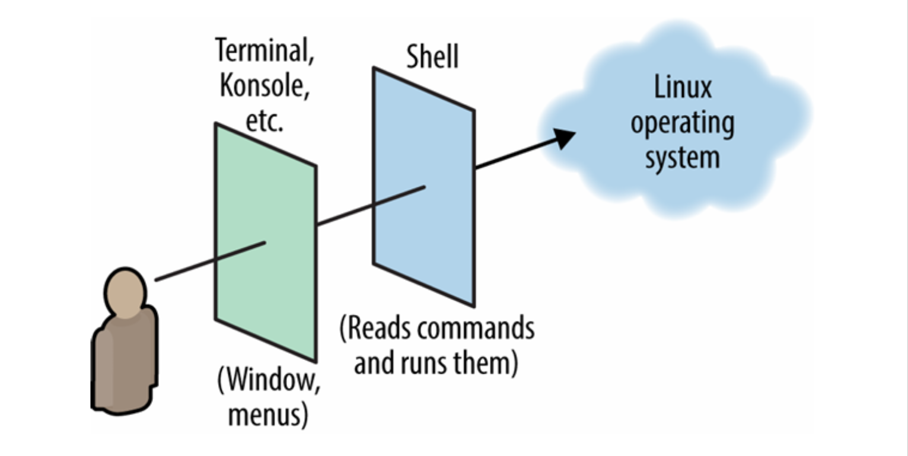
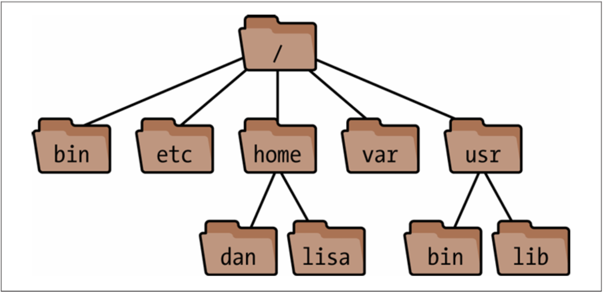

# Basic Linux Stuff ( General information )

##  What is a Shell

The primary way you or any other user will interact with the Linux operating system is through the graphical user interface complete with icons and menus. This user interface is useful for some simple tasks, like web browsing and reading emails, but the true power of Linux lies in use of the _shell_. 

The shell exists beneath the graphical user interface, and exists as a command-line interface, but how can the user interact with the shell from the GUI? The good news is that despite many graphics interfaces existing for Linux such ash GNOME, KDE, and Cinnamon, they all come with a preconfigured program called a _terminal_. The terminal program will be called by different names depending on the Linux distribution (Terminal, Konsole, etc.), but they all allow the user to issue commands to and read output from the shell.  



## Shell Prompts


 Commands can only be executed if the Linux shell if it is ready to accept them. The shell will notify you it is ready by displaying a _prompt_. The prompt may be a symbol such as a dollar sign:


<code>$</code>

 or a complex string that displays information about who is signed in and on what machine:


<code>liamcristescu@Desperado:~$</code>

 The styles of prompt are myriad, and will vary depending on which version of Linux is installed on your machine. In these instructions, this symbol <code>-></code> will be used to indicate a shell prompt and should not be typed as part of a command.


## What is a command

A Linux command usually consists of the invocation of a program that is installed on your machine, typically followed by options and arguments. You can think of this as invoking a Java or C++ function that is defined somewhere else in your program or a library. It will look something like this: 


```
-> wc -l myfile
```


The program name (wc, short for “word count”) refers to a program installed elsewhere on the disk that will be run by the shell. Here, Word Count has been invoked with the `-l` option, telling the program to count _lines_ instead of words. Additionally, `myfile` has been supplied as an argument, telling _word count_ to count the number of words (or, in this case, lines) in `myfile`.


## How commands work

So what happens between executing a shell command and seeing the output displayed on your screen? The answer is: “it depends.” Depending on the command being executed, the shell will take different actions. There are three cases:


1. The executed command is a _shell builtin_: The function of this command is built into the shell, and thus these will be executed the fastest and with the least amount of computational overhead. The `cd` command is the most common example of this. 
2. The executed command is an installed program: The function of this command is defined in a binary executable installed on the machine. The Linux operating system comes with many executable commands pre-installed, and many more can be added by the user. The `ls` command is one such executable. 
3. The command is an _alias_: An alias a kind of ‘shortcut’ to a different command in the shell that can be created by the user. Depending on which Linux distribution you have installed, there may be pre-configured aliases. For instance, Ubuntu will have `ll` pre configured as a shortcut for `ls -l`.

###  Command Line Practice

Here are some basic commands you can execute to get used to the feel:
```
-> whoami
```
will ask the shell to print the user that is currently logged in.
```
-> cal aug 2024
```
will print the calendar of August 2024 to the command line.


```
-> wget http://linuxpocketguide.com/sample.pdf
```


Download a pdf from the internet into your current directory without a web browser.


```
-> ls /bin
```


will print the contents of the binaries folder, where many commands and programs are stored.


```
-> df -h /
```


Shows how much space is used on a partition of your hard disk


```
-> top -d1
```


Will allow you to watch the processes running on your machine (type “q” to quit this program)


```
-> last -1 $USER
```


Shows how long you’ve been logged in.


```
-> whois csumb.edu | less
```


Will show who owns the domain name _csumb.edu_ (press the spacebar to move forward page by page, and type “q” to quit)

An important reminder, Linux shells are case-sensitive! Getting the case wrong may execute the wrong command, or no command at all!


```
-> Ls /bin
Ls: command not found
```


Because we have executed the _ls_ command with and incorrect capitalization, the shell has not recognized the command, and informed us that the action could not be executed.


## Command options and how to read them

A note on how commands will be described in these materials, and the difference between an _option_ and an _argument._

Many commands will have options that change how they behave. When commands are being described, you will see them listed in this format:


```
ls [options][files]
```


which means you would type “ls” followed by the options and then the filenames. The square brackets indicate that the contents are optional.


## man & -h/–help 

Although we will cover many commands and many more options for these commands here, you may yet need more information not provided within the materials for this section. Luckily, there are a few ways Linux has accounted for the average user’s lack of encyclopedic knowledge on every command.

Many commands have a help option! This option is usually “-h” or “--help.” Try this now with the “ls” command: 


```
-> ls –help
```


The `man` command is also an option, this displays an online manual page, known as a _manpage_ for a given program. Try executing the `man` command with `ls` as the argument like below: 


```
-> man ls
```


## Users and Superusers 

Linux, being a multi-user operating system, is designed so that multiple users can work on a single computer at the same time. This system is designed such that each user owns their own private part of the system in which they can do their work, this means that users will only be able to access files and directories that they have created. 

There is, however, a special user known as the _superuser_ who has the ability to access, modify, or delete anything on the system, including files and directories that they themselves have not created. This user is typically referred to as the _root user_.

Root user permissions are not enabled by default in the shell, and must be activated by prepending _sudo_ to certain commands. For example, executing this command:

```
-> touch /bin/newFile
touch: cannot touch '/bin/newFile': permission denied
```


will result in the shell denying us permission, this is because _/bin_ is a protected folder and is not accessible to normal users. However, executing: 


```
-> sudo touch /bin/newFile
```


will prompt the user to enter root’s password in order to temporarily be given superuser permissions, allowing the user to modify the protected folder. 

**_WARNING:_** The use of the sudo command is very powerful, and should only be used with extreme caution, as it gives the user the power to delete essential files, including those that are necessary to the functioning of the operating system. Some actions cannot be undone!


## Command history

Doing any kind of work on the Linux command line can sometimes involve executing the same command repeatedly, think of having to continually recompile source code after making changes or having to re-execute a failed download. 

These are situations you will undoubtedly encounter in your time on the command line. While retyping the same commands multiple times will get the job done, true power on the command line comes from finding ways to accomplish tasks with increased efficiency through shortcuts.

One such shortcut is the **up and down arrow keys**, this will allow you to browse through commands you have recently executed. From a blank prompt. Pressing the up key once will fill the prompt with your previous command, pressing up again will show the command before that, and so on.

You can also execute this command: 


```
-> history | tac | less
```


this command will print the file that stores your command history page by page (press space bar to print a new page and “q” to quit). This can be preferable to seeing the command entries displayed one-by-one on the prompt.


## Auto-complete Commands

Another helpful shortcut that will help you in your command line journey is the use of the TAB key. Linux is fairly effective at anticipating what you are going to type next, if you are using a particularly wordy option for a command or navigating to a directory, using the TAB key will let the Shell know to fill in the best option based on what you’re trying to do. 

For instance, typing:


```
-> cd ~/Down
```


before hitting TAB will let the Shell know that it should automatically complete this command. Depending on the layout of your home directory, your command will likely be completed with: 


```
-> cd ~/Downloads
```


This can cut down significantly on typing time. It is also an effective way to see what options are available to you. For example, try typing:


```
-> cd ~/Do 
```


before hitting TAB. Notice that nothing happens, this is because there are two possible options that this command could be auto-completed to. Hit the TAB key again to have these options listed out to you. Note that this works while typing all arguments as well as options for commands.


## Killing Programs

There will be times when you want to stop a command from executing before it has finished. This may happen when a program hangs or when you open a very large file. To do this type CTRL + C. Note that this can cause programs not to ‘clean up’ properly when they close, leaving your shell without a prompt

## VIM

## The Filesystem


### Directories


In Linux, files are referred to as _directories_. In a typical desktop environment, you can see the files and directories that you’re interacting with on the screen. In a command-line environment like the Linux shell, these files and directories are still present, but are not visible to the user. This means that while working in the shell you will have to remember which directory you are working in. 

This may prove to be difficult for new command-line users, but once you are familiar with your system, you’ll find that you can navigate through the file system faster than you could on a typical system. 

You can use commands like <code>pwd</code> (for “print working directory”) and <code>cd</code> (for “change directory”) to keep track of where you are and change directories.


### The File Tree





You can think of the Linux filesystem as a tree, where subdirectories branch from their parent directories, and the _root_ directory is denoted with a “/”.

Directories are referred to with a series of names and slashes called the _path_, so for instance, the path: 


```
/one/two/three/four
```

refers to the root directory “/”, which contains a directory called _one_, which contains a directory called _two_, which contains a directory called _three_, which itself contains a file called _four_. Much like other tree-like structures, directories in the Linux filesystem have child/parent relationships, with _parent directories_ being called just that, and child directories being referred to as _subdirectories_. This means that a given directory could have any number of subdirectories, but each directory will only have one parent directory.


### System Directories

Within the root directory, there are many subdirectories that contain files essential for the function of the operating system. Some, but not all of these directories will be listed here for your convenience.


* _/bin_: The _bin _folder is where the operating system stores its binaries. These are executable files that are essential to the programs running on your system
* _/etc_: The _etc _folder is where many configuration files are kept
* _/home_: This is where the home directories for the different users are stored, not that the root user does not have a home directory
* _/var_: Files stored in _var_ are temporary, they are a place for the operating system to create, edit, and delete information in runtime. 

This list is by no means exhaustive, but it is a good place to start for the curious. Do some research on your machine and see what else you can find!


### Absolute and Relative Paths

It is also important to note that the Linux shell makes use of what are referred to as _absolute_ and _relative_ paths. An absolute path is one that begins from the root directory. For example, in the image above, there are two directories named “_bin._” One has an absolute path of _/bin_ and the other has an absolute path of _/usr/bin_. Simply referring to the “_bin_” directory leaves an incomplete picture, more information is needed. A relative path, on the other hand, is any path that does not begin with the root directory “/”.

In order to properly interpret a relative path, you must know “where” in the filesystem you are currently working. This is know as your _current working directory_. Every shell has a current working directory, and running commands executes them in relation to that directory.

For instance, assume your current working directory is “_/usr_”, referring to “_bin_” in this directory will actually be referring to “_/usr/bin_”. This is the general case, for another example, assume your current working directory is “/_one/two/three/four_” and you refer to “_a/b/c_”. This will imply an absolute path of “/_one/two/three/a/b/c_”

There are also two special relative paths: . (a single period) and .. (two periods in a row). A single period refers to your current working directory, and two periods refers to your parent directory (one step above). If your current working directory is ‘_/one/two/three_’, then .. refers to ‘_/one/two'_.


### Changing Working Directory

Moving from one directory to another is simple, and only requires you to execute the <code>cd</code> command:


```
-> cd /usr/local/bin
```


The “_cd_” command can accept both absolute and relative paths for its argument:


```
-> cd d         ## enters the subdirectory d
-> cd ../mydir	## go up to the parent directory, then into the directory mydir
-> cd ~         ##takes you back to the logged user's home directory
```


# Command information ( Specific to practice challenges )
## File operations 


### Ls


```
ls [options] [files]
```

The _ls_ command (pronounced as it is spelled, _ell ess_) lists attributes of files and directories. You can list files in your current working directory:


```
-> ls
```


In given directories:


```
->ls mydir mydir2 mydir3
```


Or individually:


```
-> ls myfile myfile2 myfile3
```


There are a few options for _ls _that will be used very commonly. Do some research and find out what they are!


### Touch


```
touch newfile
```


Touch will create a new empty file with the name specified in the argument. It should be noted that in Linux, every file is treated as a simple text file unless an extension is specified. Executing: 


```
-> touch myScript
```


will create an empty text file called _myScript_, while executing: 


```
-> touch myScript.py
```


will create a new empty python script that can be later executed. 


### Cp


```
cp [options] files (file OR directory)
```


The cp command (for “copy”) copies one or more files into a different directory. Lets say you wanted to copy a file into _mydirectory_:


```
-> cp myfile myfile2 myfile3 mydirectory
```


**Useful Options**


    -p    Copy the files contents in addition to its permissions, timestamps, and it’s owner and group (whereas they would normally be owned by the copier, timestamped now, and with default permissions)

    -i 	Interractive mode, will ask before overwriting destination files


    -f 	Force the copy. If a destination file already exists, it will be overwritten unconditionally


### Mv


```
mv [options] source target
```


The _mv_ (for “move”) command will move a file to another directory:


```
-> mv myfile destination-directory
```


Interestingly, this can also be used to rename a file by moving the file into a newly named file in the same directory:


```
-> mv fileWithAName ./fileWithAnotherName
```


**Usefult Options**


    -i	Interactive mode. Ask before overwriting destination files.


    -f	Force a move. If a destination file already exists, it will be overwritten unconditionally


### Rm


```
rm [options] files OR directories
```


The rm (for “remove”) command can delete files:


```
->rm deleteme deleteme2
```


or recrusively delete directories:


```
-> rm -r myDirectory
```


**Useful Options**


    -i	Interactive mode. Will ask before deleting each file


    -f	Force the deletion of a file or directory, this ignores any errors or warnings


    -r	Recursively remove a directory and its contents. Use with caution, especially when combined with _-f_. This could wipe all the files on your computer.

A common joke you will find on online message boards will be pranksters who respond to those in need of technical assistance by informing them their problem will be fixed by ‘removing the French Language Pack’ from their machine. This involves executing: 


```
-> rm -fr /
```


As you might expect, this has the effect of recursively and forcibly removing the root folder, destroying the entire operating system installation. 


## File Viewing


### cat 

`cat [options] [files]`

cat is by far the simplest way to view the contents of a file. It will simply print the contents of the file to standard output (the terminal). Using _cat _with multiple files for arguments will concatenate the file contents (hence the name): 


```
-> cat myfile
```


Large files will scroll off your screen. In most terminals you have the option to scroll, but this is not always the case. _cat_ is also very useful for sending file contents into a shell pipeline, an advanced technique that will not be covered here

**Useful Options **


    -T	Print tabs as ^I


    -E	Print newlines as $


    -v	Print other nonprint characters in a human-readable format


    -n	Prepend line numbers to every line


    -b	Prepend line number to nonblank lines


    -s 	Squeeze each sequence of blank lines into a single blank line


### Less


```
less [options] [files] 
```


Use _less _to view text one “page” at a time (i.e., one window or screenful at a time):


```
-> less myLongFile
```


This is very useful for viewing large text files that might otherwise take up the entire screen.

**Useful Options**


    -c	Clear the screen before displaying the next page. This avoids scrolling and may be more comfortable on the eyes


    -m  Print a more verbose prompt, displaying the percentage of the file displayed so far


    -N	Display line numbers


    -r	Display control characters literally; normally `less `converts them to a human-readable format

## File Editing
### vim ADD MORE TO
```
vim filename
```
vim is one of many file editors that can be installed in Linux, it is an enhanced version of a classic Linux text editor named vi.

When opening a file with *vim*, you will not immediately be able to add or remove text. To add or remove text from the document, you must enter `insert` mode by pressing the `i` key. 

When in `insert` mode, you will not be able to exit the editor or save your work. To do so, you must first exit `insert` mode by using the `escape` key. In order to save and quit your work on the file you are editing, you must enter `:wq`. This tells *vim* to 'write' your changes and then quit the program.

These are just the basics of using *vim*, and there are many more command line-based text editors besides, the best way to get familiar with *vim* is to practice using it. 

 // using vim as a code editor

~~*vim* can be notoriously complicated to use, but executing the command:~~
```
-> vimtutor
```
will start an interactive tutorial on how to use it.

## Directory Traversal and Manipulation


### Cd


```
cd [directory]
```


The cd (for “change directory”) command sets your current working directory.


### Pwd


```
pwd
```


The _pwd _command will print the absolute path of your current working directory.


### Mkdir


```
mkdir [options] directories
```


mkdir (“for Make Directory”) creates one or more directories.

**Useful Options**

```
    -p	Given a directory path, will create any necessary parent directories automatically. The command:

        ->mkdir -p one/two/three

    creates one and one/two and one/two/three if they don’t already exist.
```

### Rmdir

```
rmdir [options] directories
```

The _rmdir_ (remove directory) command deletes one or more empty directories you name: 
```
-> mkdir /tmp/junk		## makes a directory
-> rmdir /tmp/junk      ## deletes that directory
```

rmdir only works on empty directories. If you want to delete a non-empty directory and it’s contents, then you must use _rm -r_

## Searching and Finding

### Grep
```
grep [options] pattern [files]
```
The _grep_ command's premise is simple. Given one or more files, print the lines in that file that match the supplied pattern. Given a file called *randomText* that contains these lines: 
```
The quick brown fox jumped over the lazy dogs!
My very eager mother just served us nine pancakes. 
Film at eleven.
```
we can search for all the lines containing "pancake". We get: 
```
-> grep pancake randomText
My very eager mother just served us nine pancakes
```
**Useful Options**
```
-v  Print only lines that do not match the regular expression

-c  Print only a count of matching lines

-n  In front of each line of matching output, print its original line number
```

### Find
```
find [directories] [expression]
```
The find command searches one or more directories (and their subdirectories recursively) for files matching certain criteria. Using it can be difficult due to the unusual nature of the syntax and over 50 options.

Find a particular file named 'myfile': 
```
-> find . -type f -name myfile -print
./myfile
```
Print all directory names: 
```
-> find . -type d -print
.
./jpegexample
./dir2
./mydir
./mydir/dir
./dir1
./dir2
./d
```
**Useful Options**
```
-name (pattern)     The name (-name), pathname (-path)

-type (t)           Locate only files of type (t). can be plain files (f), directories (d), and others

-user (name)        File is owned by the given user

-group (name)       File is owned by the given group

-empty              File had zero size, and is a regular file or directory
```
